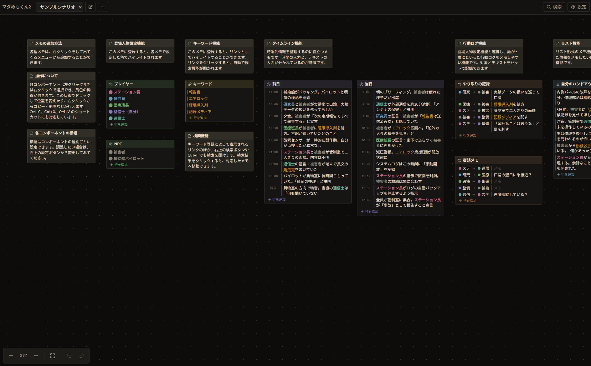

# murder-memo2

マーダーミステリー用のメモボードアプリです。React Flow ベースのキャンバスにノードを配置し、IndexedDB へ保存します。

[board.qwqb.net](https://board.qwqb.net/)

## コマンド

| コマンド                       | 内容                                             |
| ------------------------------ | ------------------------------------------------ |
| `npm run dev`                  | 開発サーバー起動                                 |
| `npm run build`                | 型検査とプロダクションビルド                     |
| `npm run preview`              | ビルド成果物のローカル確認                       |
| `npm run check`                | lint・フォーマット検査・型検査・テストの一括実行 |
| `npm run test`                 | テストのみ実行                                   |
| `npm run lint` / `npm run fmt` | oxlint / oxfmt の個別実行                        |

## デプロイ

GitHub へのプッシュを契機に Cloudflare Workers Builds がビルドと配信を行います。

初回セットアップの手順は次の通りです。

1. GitHub にリポジトリを作成してプッシュする
2. Cloudflare ダッシュボードの Workers & Pages で「Import a repository」からこのリポジトリを接続する
3. ビルド設定に Build command `npm run build`、Deploy command `npx wrangler deploy` を指定する

静的アセットの配信設定は `wrangler.jsonc` に、ビルド時の Node バージョンは `.node-version` に定義しています。
